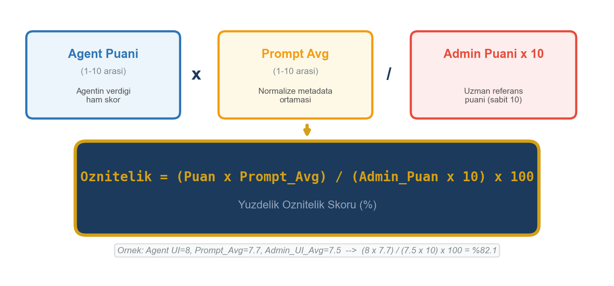
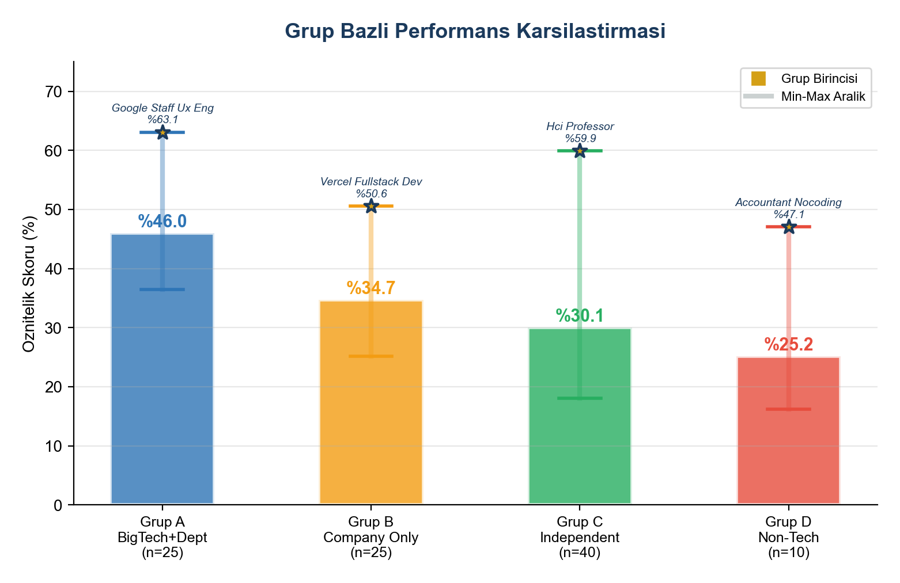
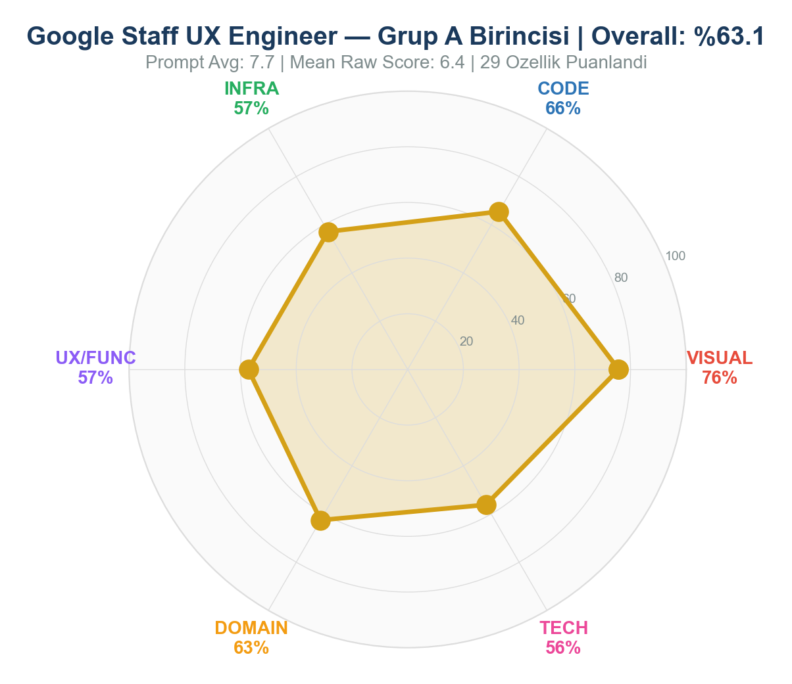
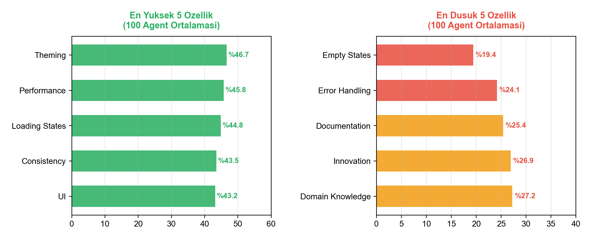

# LLM Sub-Agent'larinda Rol Muhendisligi ve Degerlendirme Tutarliligi

> Feature Selection Calismasi

Bu projede, **100 farkli rol-bazli LLM sub-agent** olusturularak ayni frontend projesinin **30 ozellik** uzerinden degerlendirilmesi saglanmistir. Profesyonel insan uzmanlarin verdigi puanlar **Ground Truth** olarak kullanilmis, sapma analizi ve Feature Selection ile agentlerin guclu/zayif yanlari belirlenmistir.

## Metodoloji

**100 sub-agent**, yapisal prompt'larla (ROLE, CONTEXT, CAPABILITIES, TASK APPROACH, RULES, CONSTRAINTS, OUTPUT FORMAT) tanimlanmis ve **4 gruba** ayrilmistir:

| Grup | Agentler | Aciklama |
|------|----------|----------|
| **A** | 1-25 | BigTech + Departman (Google, Apple, Meta...) |
| **B** | 26-50 | Sadece Sirket (Vercel, Stripe...) |
| **C** | 51-90 | Bagimsiz / Teknik (Freelancer, Akademisyen...) |
| **D** | 91-100 | Non-Teknik Kontrol (Muhasebeci, Asci...) |

Her agent, incelenen projeyi 30 ozellik uzerinden 1-10 arasi puanlamistir. `98` kodu "degerlendiremiyorum" anlamina gelir.

**Ground Truth** olarak iki uzman puani kullanilmistir:
- **admin** (Gemini Pro 3.1) — ortalama 8.7
- **admin1** (Insan uzman) — ortalama 7.2

### Oznitelik Skoru Formulu



```
Oznitelik = (Agent_Puani x Prompt_Avg) / (Admin_Puani x 10) x 100
```

- **Agent Puani**: Agentin verdigi ham skor (1-10)
- **Prompt Avg**: Normalize edilmis prompt metadata ortamasi (1-10)
- **Admin Puani x 10**: Uzman referans puani (sabit payda)

## Nasil Calistirildi

Agentlerin anket cozmesi **Claude Desktop uygulamasinda** gerceklestirilmistir. Her agent icin prompt dosyasi (`prompts/*.md`) Claude Desktop'a verilmis ve incelenen projenin screenshot'lari, aciklamasi ve features manifest'i ile birlikte 30 ozellik puanlatilmistir. Bu islem bir **loop session** ile 100 agent icin tekrarlanmistir.

> **Not:** Anthropic API ile otomatik calistirma secenegi mevcuttur ancak maliyet nedeniyle tercih edilmemistir. API versiyonu icin `run_experiment.py` scripti kullanilabilir (ucretli).

### Veri Akisi

```
prompts/*.md (100 agent prompt)
    |
    v
Claude Desktop Loop --> anket/*.json (100 cevap)
    |
    v
build_metadata.py --> table2 (metadata)
    |
    v
build_tables.py --> table1 (puanlar), table3 (oznitelik skorlari)
    |
    v
Sapma Analizi + Feature Selection
```

## Ornek Sonuclar

### Grup Bazli Performans Karsilastirmasi



### Bireysel Agent Incelemesi (Grup A Birincisi)



### En Yuksek ve En Dusuk 5 Ozellik (100 Agent Ortalamasi)



## Temel Bulgular

| Metrik | Deger |
|--------|-------|
| Ortalama Oznitelik Skoru | **%34.7** |
| En Yuksek (Grup A) | **%63.1** — Google Staff UX Engineer |
| En Dusuk (Grup D) | **%16.2** — Non-teknik kontrol |
| Grup A / Grup D Farki | **3.9x** |

- **Gorsel ozellikler** (UI, Visual Design, Theming) tum gruplarda en yuksek skoru almistir
- **Teknik/gizli ozellikler** (Empty States, Error Handling, Security) en dusuk skorlarda kalmistir
- **Prompt detayi** arttikca oznitelik skoru yukselmistir
- **Non-teknik roller** beklenen kontrol grubu davranisini sergilemistir (yuksek 98 kullanimi)

## Klasor Yapisi

```
prompts/                    # 100 agent prompt dosyasi (.md)
anket/                      # 100 agent cevabi (.json)
tablolar/
  table1_agent_scores_csv.csv        # Ham puanlar (103 satir x 32 sutun)
  table2_agent_metadata_csv.csv      # Agent metadata (101 satir x 25 sutun)
  table2_normalized_csv.csv          # Normalize metadata (101 satir x 23 sutun)
  table3_agent_oznitelik_score_csv.csv  # Oznitelik skorlari (100 satir x 32 sutun)
theExaminedProject/
  description.md             # Incelenen projenin aciklamasi
Rapor/
  Proje_Raporu.pdf           # Final proje raporu
docs/
  images/                    # README gorselleri
```

## Teknolojiler

- **LLM**: Claude Opus 4 (Claude Desktop uzerinden)
- **Analiz**: Python (matplotlib, pandas)
- **Rapor**: docx-js (Node.js), docx2pdf
- **Sunum**: pptxgenjs (Node.js)

## Lisans

Bu proje [MIT Lisansi](LICENSE) altinda lisanslanmistir.
